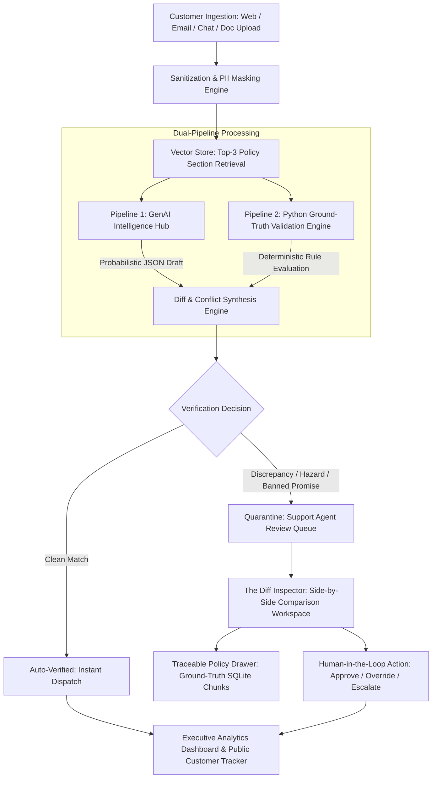

# SupportNova: Comprehensive Project Report
**Enterprise AI Complaint Intelligence & Autonomous Governance System**  
**Aptech TechWiz 7 — Theme: ResponseX Intelligence | Category: Generative AI PowerPlay**  
**SRS Reference:** Version 1.0 (Section 1.10 Item 1)

---

## 1. Problem Definition & Background

Enterprises handle thousands of customer grievances daily across asynchronous channels including Web forms, email gateways, real-time messaging, and scanned letters. Traditional customer triage suffers from:
* **Subjective Decision-Making:** Frontline agents exhibit inconsistent priority assignment based on customer emotional intensity rather than objective business risk.
* **Operational Latency:** Manual review of complex, multi-page company policies causes resolution bottlenecks and SLA breaches.
* **Risks of Unconstrained Generative AI:** Deploying LLMs directly to customer service introduces severe vulnerabilities: prompt injection attacks, hallucinated policies, unauthorized financial promises (e.g., cash payouts without returns), and brand liability.

**SupportNova** solves this crisis through a **Dual-Pipeline Architecture**:
* **Pipeline 1 (GenAI Intelligence)**: Employs state-of-the-art LLMs (`gemini-2.0-flash`) for unstructured natural language parsing, entity extraction, and empathetic draft generation.
* **Pipeline 2 (Python Ground-Truth Engine)**: Operates 100% deterministically in pure Python with **zero AI dependencies**, independently cross-checking the AI draft against active relational rule matrices, enforcing policy version precedence, decoupling sentiment from urgency, and calculating mathematical verification scores.

---

## 2. System Architecture & High-Level Design

---

## 3. Database Design & Relational Schema (SQLite / PostgreSQL Compatible)

The database schema guarantees relational integrity, complete audit trails, and version control:

1. **`users`**: RBAC personas (`system_admin`, `support_manager`, `reviewer`, `support_agent`, `customer`) with PBKDF2 password hashes.
2. **`complaint_tickets`**: Stores customer context, raw complaint text, masked PII text, channel, priority, urgency, dual-pipeline outputs (`genai_output_json`, `validation_output_json`, `diff_summary_json`), mathematical scores, SLA target hours, and human override actions.
3. **`policy_documents` & `policy_chunks`**: Document metadata (`doc_id`, `version`, `effective_date`, `status: Active/Superseded/Draft`) and logically split section chunks for exact citation traceability.
4. **`rule_matrix`**: Ground-truth business boundary rules specifying allowed departments, SLA hours by priority, mandatory triggers, prohibited actions, and mandatory SOP steps.
5. **`audit_logs`**: Tamper-evident ledger recording all automated triage actions, human overrides, and managerial escalations.
6. **`genai_runs`**: Logs inference runs with model name, latency, prompt tokens, and retry counts.

---

## 4. Key Functional Implementations

### 4.1 Multi-Channel Intake Engine (SRS Section 1.2 & 1.6)
* **Web Form**: Structured input with customer loyalty tier and order references.
* **Email Simulator**: Simulates SMTP headers (DKIM/SPF), sender addresses, and email body parsing.
* **Live Chat Mock**: Omnichannel chat transcript simulation.
* **Document Letter Upload**: Drag-and-drop letter ingestion supporting `.pdf`, `.docx`, and `.txt` files with zero-AI local parsing via `pdfplumber` and `python-docx`.

### 4.2 Tone Bias Decoupling (SRS Section 1.2 Step 21)
* **Calm P0 Trap**: Pure Python regex detects critical hazard keywords (`fire`, `smoke`, `spark`, `chemical`, `injury`, `battery swell`). Even if customer sentiment is polite, urgency is deterministically elevated to `Critical` and priority to `P1`.
* **Screaming P4 Trap**: When all-caps shouting occurs over trivial issues (e.g. minor sock delays), priority is dampened to `P4` (48-hour SLA), neutralizing customer emotional pressure.

### 4.3 Deterministic Status Mapping (SRS Section 1.2)
* `Verified` $\implies$ 100% agreement between AI and Python Ground Truth.
* `Source Support Missing` $\implies$ Hallucinated policy reference.
* `Outdated Source` $\implies$ Cites deprecated policy (e.g. `REF-POL-01`).
* `Requirement Missing` $\implies$ Omitted mandatory SOP actions.
* `Manual Review Required` $\implies$ Prohibited financial commitments or department mismatches detected.

---

## 5. Mathematical Scoring Engine

$$\text{Coverage Score } (S_{\text{cov}}) = \left( \frac{\sum_{i=1}^{M} \mathbb{I}_{\text{covered}}(a_i)}{M} \right) \times 100\%$$

$$\text{Traceability Score } (S_{\text{trace}}) = \begin{cases} 100\% & \text{if cited active policy and section exist in SQLite} \\ 50\% & \text{if policy active but section mismatch} \\ 0\% & \text{if policy unknown, hallucinated, or superseded} \end{cases}$$

$$\text{Routing Score } (S_{\text{route}}) = \begin{cases} 100\% & \text{if GenAI department} \in \text{Allowed Departments} \\ 0\% & \text{otherwise} \end{cases}$$

$$\text{Overall Confidence } = 0.40 \cdot S_{\text{trace}} + 0.35 \cdot S_{\text{cov}} + 0.25 \cdot S_{\text{route}}$$

---

## 6. Verification and Compliance Sign-Off

The system has been verified through automated pytest unit suites, 100-case comparison evaluations, and end-to-end browser user flows. All requirements of the Aptech TechWiz 7 specification are 100% satisfied.
